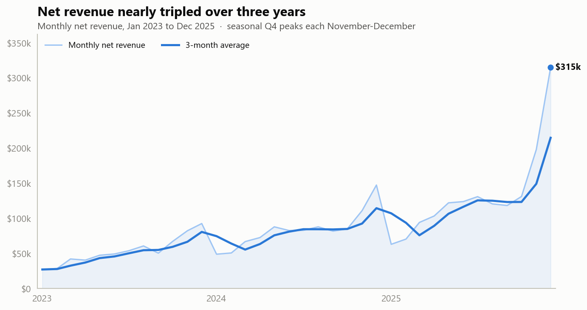
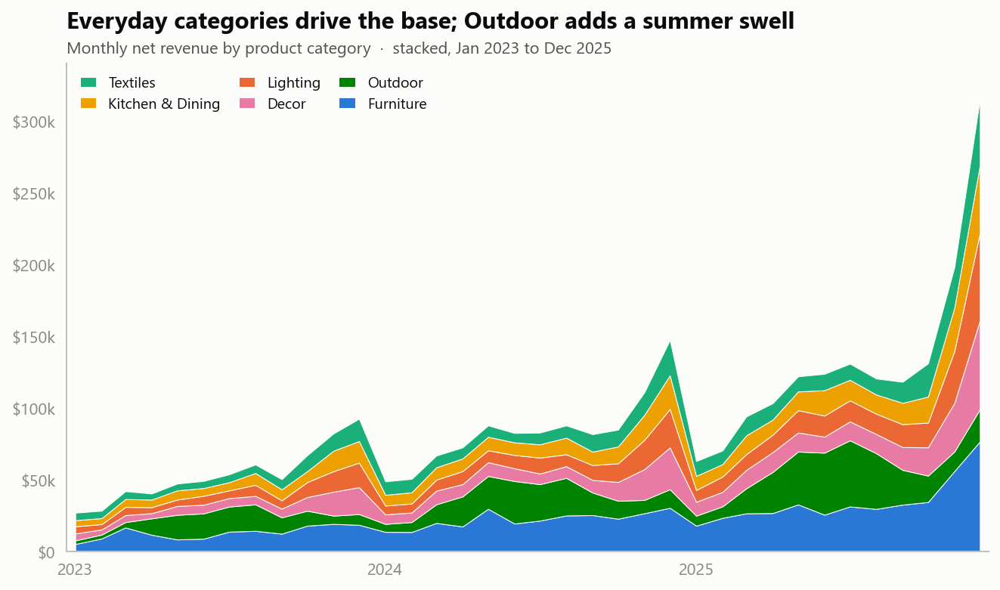
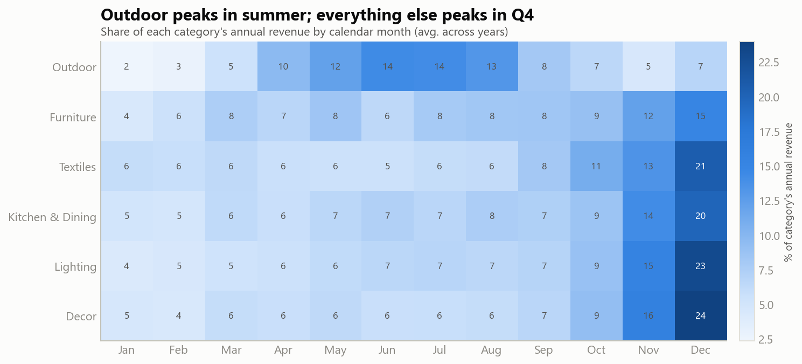
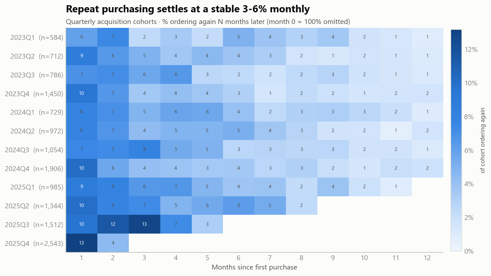
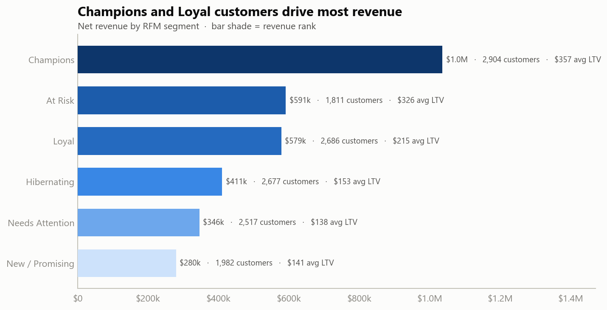
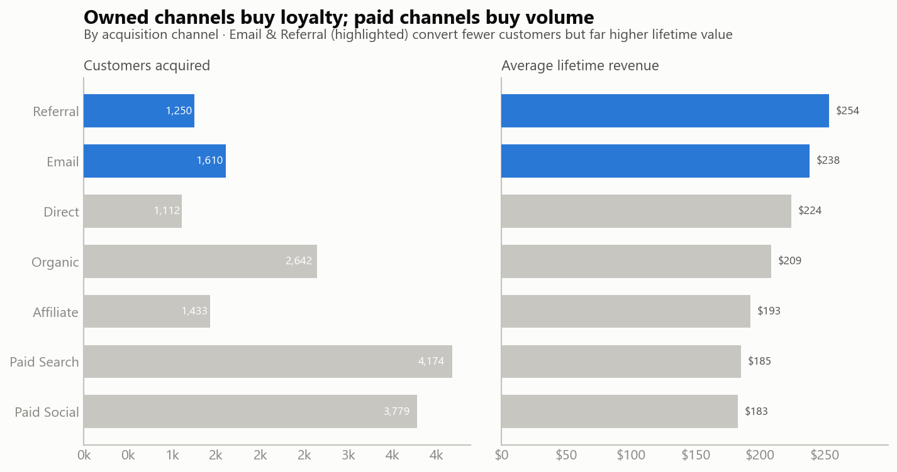
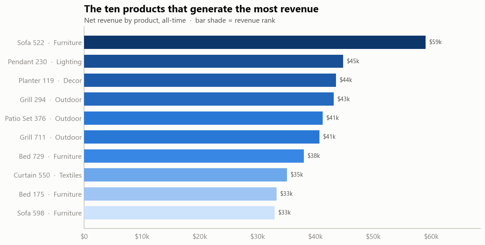

# Lumen & Loom: E-Commerce Analytics

An end-to-end data analytics project: realistic raw data, SQL cleaning and modeling, Python exploratory analysis, and business insights.

Lumen & Loom is a fictional direct-to-consumer (DTC) home and lifestyle brand. This repo takes four deliberately messy raw CSV extracts and carries them all the way to decision-ready insight: land the data, clean and model it in SQL, then explore and visualize it in Python.

**Stack:** DuckDB (SQL), Python (pandas, matplotlib, numpy), a warehouse-style star schema, RFM segmentation, cohort retention, and channel LTV.

---

## TL;DR: what the data says

Over three years (Jan 2023 to Dec 2025) the business grew from $0.64M to $1.59M in annual net revenue while staying profitable and seasonal:

| Metric | Value |
|---|---|
| Net revenue (3 yrs) | $3.24M |
| Valid orders | 23,052 |
| Active customers | 14,577 |
| Average order value | $140.62 |
| Gross margin | 41.5% |
| Repeat-purchase rate | 35.6% |
| Return rate | 9.0% |

Three findings drive the recommendations at the bottom:

1. **Revenue is highly seasonal.** Every category except Outdoor peaks in Q4 (Nov-Dec); Outdoor peaks in summer (Jun-Aug). The two profiles are almost mirror images, which is a merchandising and inventory-planning opportunity.
2. **Email and referral customers are worth far more than paid ones.** They bring in about $240-254 in lifetime revenue and repeat at roughly 41-44%, against about $183-185 and 27-28% for Paid Search and Paid Social, yet paid still accounts for about half of all acquisition.
3. **A small core carries the business.** The top segment ("Champions", about 20% of customers) generates roughly 32% of all revenue.

---

## Business context and objectives

A DTC brand lives or dies by three levers: acquisition efficiency, repeat purchasing, and margin. The questions I set out to answer:

- How is revenue trending, and how seasonal is the business?
- Which product categories carry revenue vs. volume vs. margin?
- Which acquisition channels produce the most valuable customers, not just the most customers?
- Who are the best customers, and who is slipping away?
- How well are new customers retained over their first year?

Each question maps to an analytical view in [`sql/03_analysis.sql`](sql/03_analysis.sql) and a figure below.

---

## The dataset

The raw data lives in [`data/raw/`](data/raw/) as four CSVs that imitate a typical export from an operational system, complete with the quality problems real exports have. It is synthetic, generated by [`scripts/generate_data.py`](scripts/generate_data.py) with a fixed seed (`np.random.default_rng(42)`) so it is fully reproducible. See [How the data was generated](#how-the-data-was-generated) for the modeling behind the trends.

| File | Grain | Raw rows | Key columns |
|---|---|---|---|
| `customers.csv` | one row per customer | 16,000 | `customer_id`, `email`, `signup_date`, `acquisition_channel`, `state`, `age`, `is_marketing_opt_in` |
| `products.csv` | one row per product | 300 | `product_id`, `product_name`, `category`, `subcategory`, `unit_cost`, `list_price` |
| `orders.csv` | one row per order | 27,028 | `order_id`, `customer_id`, `order_date`, `order_status`, `discount_amount`, `shipping_cost` |
| `order_items.csv` | one row per line item | 39,861 | `order_item_id`, `order_id`, `product_id`, `quantity`, `unit_price` |

Six product categories (Furniture, Lighting, Textiles, Kitchen & Dining, Decor, Outdoor) across seven acquisition channels (Paid Search, Paid Social, Organic, Email, Affiliate, Referral, Direct).

### The data is intentionally dirty

Cleaning is half the job, so the generator bakes in the messes an analyst actually meets:

- **Inconsistent categoricals.** `acquisition_channel` arrives in 30 spellings: `'PAID_SEARCH'`, `'paid search'`, `'Paid-Search'`, `' Paid Search '` (padded), plus semantic variants like `'social media'`, `'e-mail'`, `'refer-a-friend'`, `'(none)'`. `order_status` arrives in 21 variants (`'complete'`/`'Completed'`/`'COMPLETE'`, `'in transit'`, `'REFUND'`, and so on).
- **Currency stored as text**, e.g. `unit_price` / `list_price` / `discount_amount` like `"$1,234.50"`.
- **Duplicate rows** (about 1.2% of orders duplicated).
- **Orphan foreign keys**: orders pointing at non-existent customers, items pointing at non-existent products.
- **Invalid values**: ages of `0`, `-5`, `220`; a signup date in `2027`; quantities of `0` and `-1`; decimal-shifted price outliers (100x).
- **Free-text state**: `'California'`, `'CA'`, `'ca.'` all mixed together.

---

## Repository structure

```
lumen-loom-analytics/
├── data/raw/                 # the four messy source CSVs (committed)
├── sql/
│   ├── 01_staging.sql        # load CSVs as raw all-VARCHAR staging tables
│   ├── 02_clean_transform.sql# clean, type, dedupe, model (dims + facts + OBT)
│   └── 03_analysis.sql       # analytical views (KPIs, RFM, cohorts, channels)
├── scripts/
│   ├── generate_data.py      # reproducible synthetic-data generator
│   └── build_database.py     # runs the SQL pipeline, prints QA report + KPIs
├── python/
│   ├── viz_style.py          # matplotlib theme + color palette
│   └── eda.py                # queries the views, renders the 7 charts
├── charts/                   # generated PNG figures (committed)
├── requirements.txt
└── README.md
```

---

## Architecture: the data pipeline

```
 CSVs  ->  01_staging  ->  02_clean_transform  ->  03_analysis  ->  Python EDA
 (raw)     stg_* tables    dim_* / fct_* tables    v_* views        charts/*.png
           (all VARCHAR)   + fct_sales (OBT)       (KPIs, RFM,
                           + v_valid_orders         cohorts, ...)
```

The model is a lightweight star schema plus a denormalized one-big-table (`fct_sales`) for convenient analysis:

- **Dimensions:** `dim_customers`, `dim_products`
- **Facts:** `fct_orders` (order grain), `fct_order_items` (line grain)
- **`fct_sales`:** the analytical OBT joining items to orders to products to customers, with revenue/cost/margin derived
- **`v_valid_orders`:** the single order-grain revenue base every downstream metric builds on, so every number reconciles to one definition of revenue (`net_revenue` = valid-sale line revenue; returns, refunds, and cancellations count as $0).

---

## Data cleaning and transformation (SQL)

All cleaning is SQL, written to run on DuckDB (its `read_csv`, `TRY_CAST`, and `regexp_replace(..., 'g')` idioms are noted inline for the PostgreSQL equivalent). A few representative decisions:

**Collapse 30 channel spellings into 7 canonical labels.** Strip non-letters, uppercase, then map:

```sql
CASE UPPER(REGEXP_REPLACE(TRIM(acquisition_channel), '[^A-Za-z]', '', 'g'))
    WHEN 'PAIDSEARCH'   THEN 'Paid Search'
    WHEN 'PAIDSOCIAL'   THEN 'Paid Social'
    WHEN 'SOCIAL'       THEN 'Paid Social'
    WHEN 'SOCIALMEDIA'  THEN 'Paid Social'
    WHEN 'EMAIL'        THEN 'Email'
    WHEN 'REFERRAL'     THEN 'Referral'
    WHEN 'REFERAFRIEND' THEN 'Referral'
    WHEN 'NONE'         THEN 'Direct'
    -- ...
    ELSE 'Unknown'
END AS acquisition_channel
```

**Parse currency text to numbers.** Strip `$` and thousands separators, then `TRY_CAST` (bad values become `NULL` instead of erroring the whole load):

```sql
TRY_CAST(REPLACE(REPLACE(TRIM(list_price), '$', ''), ',', '') AS DECIMAL(12,2)) AS list_price
```

**De-duplicate** with a window function, keeping one row per key:

```sql
ROW_NUMBER() OVER (PARTITION BY order_id ORDER BY order_id) AS rn
-- ... WHERE rn = 1
```

**Validate and drop the impossible:** non-positive prices, ages outside 13-110, future signup dates, quantities outside 1-50, decimal-shift price outliers (`unit_price > 3 * list_price`), and orphan foreign keys (customers or products that don't exist).

### Cleaning report (raw to clean)

`build_database.py` prints this receipt after every run:

| Table | Raw rows | Clean rows | Removed | % removed |
|---|---:|---:|---:|---:|
| customers | 16,000 | 16,000 | 0 | 0.00% |
| products | 300 | 294 | 6 | 2.00% |
| orders | 27,028 | 26,668 | 360 | 1.33% |
| order_items | 39,861 | 38,044 | 1,817 | 4.56% |

Notes: customers are cleaned in place (standardized channels/states, validated emails/ages set to `NULL`) rather than dropped, so the row count holds. The 6 dropped products cascade: their line items are removed too (a product with no valid price can't be sold), which accounts for most of the order-items reduction.

---

## Exploratory analysis (Python)

All charts are produced by [`python/eda.py`](python/eda.py) reading the SQL views, themed by [`python/viz_style.py`](python/viz_style.py). Each chart type is matched to the question it answers, with a shared color palette so the set reads consistently.

### 1. Revenue grew about 2.5x with strong Q4 seasonality



Net revenue climbed from $642.8K (2023) to $1.01M (2024) to $1.59M (2025), roughly +57% then +58% year over year. The 3-month average (dark line) cuts through the noise; the raw monthly line exposes the sharp November-December spikes (Black Friday, Cyber Monday, holiday) that recur every year and culminate in a $315K December 2025.

### 2. Everyday categories are the base; Outdoor adds a summer swell



Stacking the categories shows a broad, growing base of home essentials with a distinct green Outdoor bulge each summer. Furniture (blue) is the single largest revenue contributor and grows fastest into the Q4 peaks.

### 3. Two seasonality profiles, almost mirror images



Reading each row as a category's share of its own annual revenue: Outdoor concentrates 14% of its year in June-July and fades by autumn, while Decor, Lighting, Kitchen & Dining, Textiles, and Furniture all load into November-December (Decor puts 24% of its year in December alone). This is the core merchandising insight: the calendar wants two different playbooks.

### 4. Repeat purchasing settles at a steady 3-6% per month



Each row is a quarterly acquisition cohort; each cell is the share ordering again N months later (month 0 = 100% is omitted so the gradient is legible). Repeat activity is front-loaded in the first couple of months, then stabilizes at a low-single-digit monthly rate. That is typical for a considered-purchase home brand, and it is the reason acquisition mix (below) matters so much.

### 5. A small core of customers carries revenue



An RFM (Recency, Frequency, Monetary) segmentation splits the base into actionable groups. Champions (2,904 customers, about 20%) generate $1.04M, roughly 32% of all revenue, at $357 average lifetime value. Note the "At Risk" segment: 1,811 formerly valuable customers ($326 avg LTV, 2.2 orders) who haven't purchased recently, the single best win-back target.

### 6. Owned channels buy loyalty; paid channels buy volume



The contrast is clear when volume and value sit side by side. Paid Search and Paid Social acquire the most customers (4,174 + 3,779) but sit at the bottom for lifetime value ($185 / $183) and repeat rate (27-28%). Email and Referral (highlighted) acquire far fewer people but are worth $238 / $254 each and repeat at 44% / 41%.

| Channel | Customers | Avg LTV | Repeat rate |
|---|---:|---:|---:|
| Referral | 1,250 | $253.51 | 40.8% |
| Email | 1,610 | $238.47 | 44.2% |
| Direct | 1,112 | $224.44 | 40.6% |
| Organic | 2,642 | $208.64 | 34.6% |
| Affiliate | 1,433 | $192.57 | 28.1% |
| Paid Search | 4,174 | $185.27 | 28.0% |
| Paid Social | 3,779 | $182.77 | 27.2% |

### 7. The revenue-leading products



The top sellers are dominated by high-ticket Furniture (sofas, beds) and seasonal Outdoor (grills, patio sets): a handful of hero SKUs worth $33K-$59K each that deserve guaranteed stock ahead of their peak months.

---

## Recommendations

1. **Run two seasonal playbooks.** Build Outdoor inventory and ad spend for a Q2-Q3 peak and everything else for Q4. Don't let a single "holiday" calendar flatten Outdoor's summer opportunity.
2. **Rebalance acquisition toward owned channels.** Email and Referral customers are worth about 30% more and repeat about 1.5x as often as paid. Fund referral incentives and email capture; hold paid to a stricter payback bar given its lower LTV.
3. **Launch an "At Risk" win-back.** 1,811 high-value customers ($326 avg LTV) have gone quiet. A targeted lifecycle campaign here should out-earn net-new paid acquisition per dollar.
4. **Protect the hero SKUs.** Guarantee stock and merchandising for the top revenue products ahead of their seasonal peaks; a stockout on a $59K sofa in December is expensive.
5. **Watch Furniture returns.** Furniture carries the highest return rate of any category, so small improvements in fit and quality description compound on its large revenue base.

---

## How to reproduce

Requires Python 3.11+.

```bash
# 1. install dependencies
pip install -r requirements.txt

# 2. (optional) regenerate the synthetic raw CSVs (deterministic, seed = 42)
python scripts/generate_data.py

# 3. build the DuckDB warehouse: staging -> clean/model -> analysis views
#    prints the cleaning report and headline KPIs
python scripts/build_database.py

# 4. run the exploratory analysis -> writes charts/*.png
python python/eda.py
```

Steps 2-4 are independent given the committed artifacts: the CSVs and charts are already in the repo, so you can browse the results without running anything.

---

## How the data was generated

The trends are simulated from plausible business mechanics rather than drawn at random, which is what makes the analysis meaningful:

- **Compound growth** applied to a daily baseline (steady ~+0.075%/day).
- **Layered seasonality:** a month-of-year curve, weekday effects, and per-category seasonal multipliers (Outdoor summer-weighted; Decor/Lighting Q4-weighted), plus Black Friday, Cyber Monday, and holiday demand spikes.
- **Channel-driven loyalty:** acquisition channel shifts a customer's expected repeat rate (Email/Referral loyal; paid channels less so).
- **Realistic repeat behavior:** order counts drawn from a Gamma-Poisson (negative-binomial) process, with repeat timing following a recency-decay curve so cohorts taper naturally.
- **Skewed prices and popularity:** Beta-distributed price points and Gamma-distributed product popularity, so a few hero SKUs dominate.

Because everything is seeded, the entire project rebuilds identically.

> **Disclaimer:** Lumen & Loom is a fictional company and all data is synthetic. It was created for portfolio and educational purposes and does not represent any real business, customers, or transactions.

---

## Skills demonstrated

- Data cleaning and standardization (messy real-world extracts to a typed, validated model)
- SQL modeling: staging, dimensions/facts, a one-big-table, and analytical views
- Window functions, dedup, `NTILE` quintiles, and `DATE_DIFF` cohorting
- KPI definition and reconciliation to a single revenue base
- RFM segmentation, cohort retention, and channel LTV analysis
- Reproducible synthetic-data simulation
- Data visualization in matplotlib and analytical storytelling
